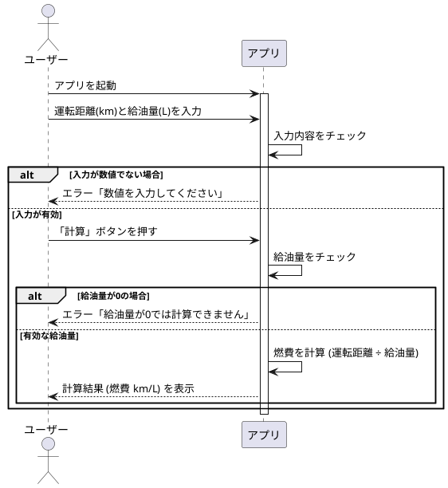
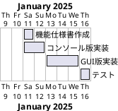

# FuelEfficiencyApp

## 概要

### アプリケーションの目的

- 燃費管理アプリは、ユーザーが運転距離と給油量を入力することで、燃費（km/L）を計算・記録するためのツールです。
- ユーザーが燃費データを定期的に記録することで、エコドライブや燃料費の削減を支援します。

### 想定ユーザー

- 個人の自動車ユーザー(主に日常的に車を利用する人)。

## 機能一覧

### メイン機能

#### データ入力

- ユーザーが「運転距離」と「給油量」を入力できる。

#### 燃費計算

- 入力された値を用いて燃費（km/L）を計算する。
- 計算式
  - 前回の給油から走行した距離(km)　 ÷ 　給油量(L)　＝　燃費(km/L)

#### データ表示

- 計算結果を画面に表示する。

### オプション機能(予定)

#### 履歴管理

- 過去の入力データを保存し、履歴として閲覧可能にする。

#### データエクスポート

- 記録を CSV 形式でエクスポート可能。

#### グラフ表示

- 燃費の履歴をグラフで可視化する機能。

### ユースケース

#### ユーザーの操作フロー

### エラーハンドリング

### 画面仕様

- 入力フォーム
  - 運転距離(テキストブロック)
  - 給油量(テキストボックス)
- 「計算」ボタン
- 出力
  - 結果ラベル(燃費の計算結果を表示)

## 非機能要件

### 開発環境

- 言語:Java 　
  openjdk version 21.0.4" 2024-07-16 LTS
  OpenJDK Runtime Environment Temurin-21.0.4+7

- 開発ツール：Eclipse
- ライブラリ:必要に応じて追加していく

### スケジュール

